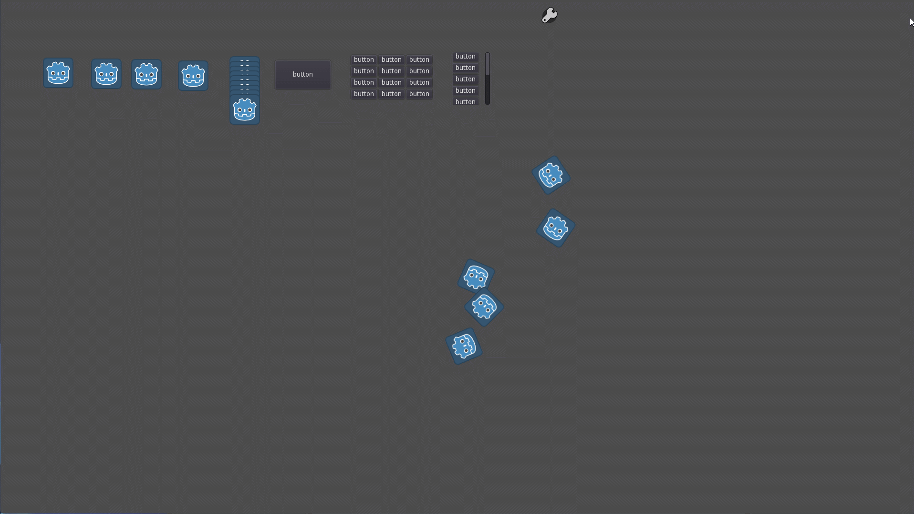
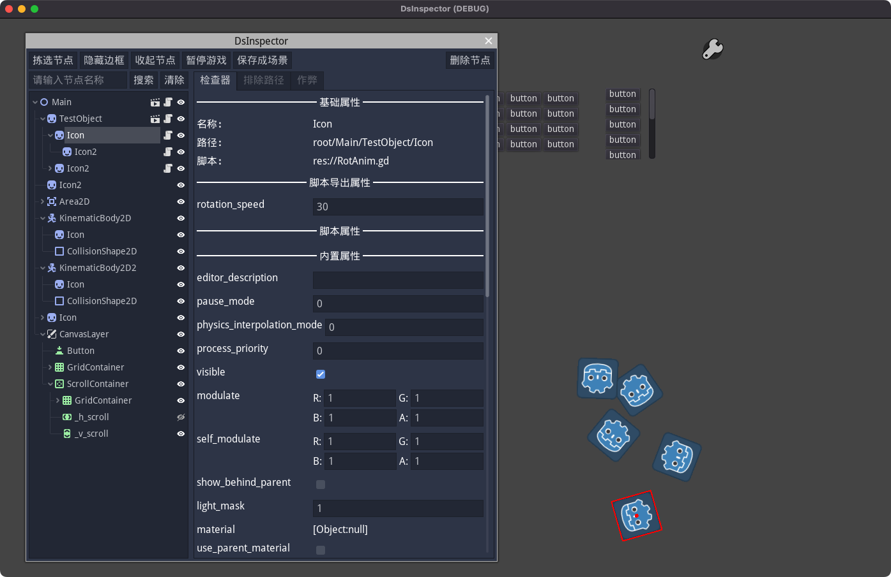
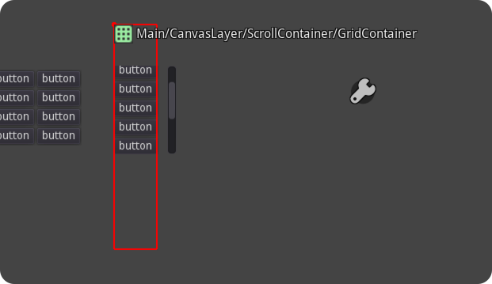

# DsInspector_GD3

[English](README.md)|[中文](README_zh.md)

**DsInspector (Developer Support Inspector)** is a runtime debugging plugin for **Godot 3** that lets you inspect and modify nodes and properties in the scene tree while the game is running.
It provides Inspector-like features similar to the editor, making debugging and testing more convenient and intuitive.

## Features

- **Real-time scene tree view**: Shows all nodes in the currently running scene, only supports 2D scene inspection, not 3D scene.
- **Node property inspection**: View and edit node properties (including exported script variables); changes take effect immediately.
- **Node search**: Quickly find target nodes.
- **Node selection & highlight**: Locate the selected node in the game view. After enabling "Pick Node", click scene elements to select them; if elements overlap, click repeatedly to cycle through stacked nodes.
- **Exclude paths**: Filter specific paths to quickly focus on relevant nodes.
- **Open script/scene path**: Quickly open associated scripts or locate scene files in the file system from the property panel.
- **Save node as scene**: Export the selected node as a new scene (`.tscn`) for reuse and sharing.
- **Cheat button helper**: Add cheat/test buttons quickly via `DsInspector.add_cheat_button()`.
- **Export automatic blocking plug-in**: This plug-in is only effective when the editor is running the game. After exporting the game, all functions of the plug-in will be automatically blocked without additional settings.

## Supported Versions

This plugin is developed and tested for the Godot 3.5+ series and does not support earlier versions.
This repository does not support versions 4.0 and above. If you need to use it in Godot4x, please use this repository: https://github.com/xlljc/DsInspector

## Installation

1. Clone this repository and copy the `addons/` folder into your Godot project's `addons/` directory.

2. Enable the plugin in `project.godot`:

   - Open `Project > Project Settings > Plugins` in the editor.
   - Find `DsInspector_GD3` and enable it.

3. Run the game — a floating icon will appear. Click it to open the inspector.

## Screenshots

### 

## License

This project is licensed under the MIT License.
